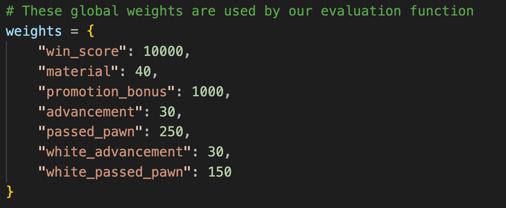

**Representation and Data Structures Questions**

1. **What representation did you choose for the game board?**

   The board is represented using two 8×8 Boolean bitmaps (2D lists) see "initialize_boards" function in agent.py. One bitmap holds the positions of the white pawns and the other for the black pawns. Each cell is either True (indicating the presence of a pawn) or False (empty).

   
   

2. **What data structures does the agent rely on?**

   - 2D Lists (Bitmaps): Used to represent the board state for each side.
   - Lists: A list of move strings is generated when considering all legal moves.
   - Dictionary: A transposition table (a dictionary) is used to store evaluated states (using a hash key of the board and side) with tuples that include search depth, evaluation score, and a suggested move.
   - Global Dictionary: A weights dictionary holds dynamic evaluation parameters that affect scoring.
   - Threading Constructs: For pondering (background search during the opponent’s move), events and threads are employed.

3. **How does the algorithm generate its moves?**

   The agent uses the generate_all_legal_moves function that scans each cell in the bitmap corresponding to the moving side.
   It calculates legal moves considering one-square and two-square forward moves as well as diagonal captures.
   Special checks (like immediate promotion moves) are made before searching further.

4. **How does the algorithm identify terminal states?**

   The function check_win_conditions examines the board.
   For White, if any pawn reaches row 0, it is a win.
   For Black, if any pawn reaches row 7, it is a win.
   Additionally, if no legal moves exist (or if the special “exit” or “gameover” signals occur), these are treated as terminal conditions.

5. **How does the algorithm manage the allotted time for the entire game?**

   Each move search is subject to a time limit (configured per move).
   The agent tracks the move’s start time and continuously checks whether the elapsed time has exceeded the limit (using time.time() - start_time > time_limit).
   This control is implemented in both the iterative deepening and recursive alpha‐beta loops, ensuring the search terminates early if necessary.

6. **Does the algorithm think while the opponent is thinking?**

   Yes. While waiting for the opponent’s move, the agent starts a background thread (via start_pondering) that performs an iterative deepening search.
   This “pondering” allows the agent to explore the game tree so that if the opponent takes a while, the agent may already have computed promising moves.

---

**Static Evaluation Function Questions**

1. **Describe the static evaluation function you designed.**

   The static evaluation function (mainly through evaluate_board_dynamic) computes a score from Black’s perspective (inverting the sign for White) based on a combination of factors like material balance, pawn advancement, promotion potential, and passed pawn status.

2. **What features from the game does it include?**

   - Material Count: The difference in the number of pawns for each side.
   - Pawn Advancement: How far each pawn has advanced toward promotion.
   - Promotion Bonus: Bonus points for pawns one move away from promotion.
   - Passed Pawn Bonus: Extra value is awarded to passed pawns (pawns that have no opponent pawn blocking their path diagonally or directly in front).
   - Terminal Win Conditions: Assigns a high positive (or negative) score when a winning condition is met.

3. **How does it extract these features from the current board state?**

   It iterates over each cell in the 8×8 bitmaps.
   For each pawn, it computes its “advancement” score based on its row index.
   It uses helper functions like is_passed_pawn to check whether a pawn is unobstructed.
   It sums these contributions while also checking for win conditions by scanning the promotion rows.

4. **How does it weigh these features?**

   The evaluation function uses a global weights dictionary containing parameters such as "win_score", "material", "promotion_bonus", "advancement", and "passed_pawn".
   Each feature’s contribution is scaled by its designated weight, meaning that features like promotions are given very high importance compared to minor material differences.

5. **What is its evaluation range?**

   The evaluation can range broadly. In terminal states, it returns either +10000 or -10000 (as configured by "win_score").
   For nonterminal states, the score is a weighted sum that may typically range in the lower thousands or less, depending on material count and advancement factors.

6. **What is the value of the function in a terminal state?**

   If the board meets a terminal condition:

   - Black wins: Returns +10000.
   - White wins: Returns -10000.

7. **How did you test its accuracy?**

   The evaluation function was tested on a set of known board configurations:

   - Edge cases: Positions where a pawn is one move away from promotion.
   - Material imbalances: Setups having different numbers of pawns.
   - Passed pawn scenarios: Boards where one side had unobstructed advanced pawns.
     These tests included both unit tests and manual verification by comparing the computed evaluation to the expected game advantage.

8. **Demonstrate its evaluation for several key game states you used to test it.**

   

   Here is a brief explanation of each parameter in the evaluation settings:

   - win_score (10000)
     A very large “prize” score awarded if an engine detects a winning condition (for instance, capturing the enemy flag or otherwise “checkmating” in a variant). It ensures that winning moves rank above all else.
   - material (40)
     The base value (or weight) used for each pawn’s material. For example, having one more pawn than the opponent might yield +40 in the evaluation.
   - promotion_bonus (1000)
     Extra score allotted if a pawn is on the verge of promoting (or has potential to promote soon). Encourages the AI to push pawns to promotion squares.
   - advancement (30)
     A bonus added for each rank (or certain ranks) that a pawn has advanced up the board. Usually used for Black pawns (if “white_advancement” is separate).
   - passed_pawn (250)
     A large bonus for a passed pawn (no opposing pawns can block or capture it on its path). Passed pawns are extremely valuable because they have a high potential to promote or force the opponent’s resources into defense.
   - white_advancement (30)
     Same concept as “advancement,” but applied specifically to White pawns. Splitting them out (rather than using a single “advancement” constant) allows adjusting White vs. Black pawn bonuses independently.
   - white_passed_pawn (150)
     Bonus for White’s passed pawns. Again, it’s separated so you can differentiate how much White is rewarded for a passed pawn vs. Black.

     ***

   - Example 1:
     A board where White has a pawn on row 0 results in an evaluation of -10000 (immediate win for White).

     
     

     ***

   - Example 2:
     A board where a Black pawn sits on row 2 (one move from promotion) would add a significant bonus (e.g., promotion_bonus of 1000) plus advancement points, resulting in a high positive score.

     
     

     lets analyze the score:
     one step away from promotion: score was -180 (notice that the white pawns are close to promotion but not there yet)
     the black pawn is one step away from promotion, so it gets a bonus of 1000
     the black pawn has advanced one square, so it gets 1000 points.
     the total score is determined by the white pawns to, but we can see that he got almost 1000 points advantage.

     ***

   - Example 3:
     In a balanced board but with Black having one extra pawn than White, the contribution from the "material" weight would tilt the score positively by approximately 10 points (adjusted further by the advancements collected).

     
     
     

     lets analyze the score:
     the board is almost balanced, so the score is 40 (one more pawn than the opponent).
     after few moves the black pawn and white pawn moved few squares forward, so the score is now 70.

   Such tests helped confirm that the function assigns higher values to positions with a clear win potential and that the weighting effectively reflects board advantages.

9. **Do you use it only at the leaves or also for pruning and/or in internal nodes?**

   The evaluation function is primarily used at leaf nodes (or at nodes where the depth limit or time limit is reached).
   It is also used in internal nodes during cutoff situations (for example, when time is nearly up or during transposition table lookups) to provide a heuristic score for pruning decisions.

---

**Search Algorithm Questions**

1. **Describe the search algorithm you chose.**

   The agent utilizes an iterative deepening approach combined with a minimax search enhanced by alpha–beta pruning.
   This method increases search depth gradually to make the best use of available time.

2. **Did you use search heuristics?**

   Yes.
   The use of iterative deepening, dynamic evaluation, and alpha–beta pruning are all heuristics that help efficiently guide the search process.

3. **Did you use a transposition table?**

   Yes.
   Creation: The transposition table is implemented as a dictionary within the AIAgent class.
   Stored Content: It maps a state key (a uniquely generated string from the board state and role) to a tuple containing the search depth, the evaluation score, and optionally the best move.
   Usage: Before evaluating a new position, the search checks if the state has been computed with an equal or greater depth. If a valid entry exists, its evaluation is reused, thus reducing redundant computation.

4. **What are the observed minimum, average, and maximum search depths of the algorithm?**

   Minimum Depth: In time-critical or very early moves, the algorithm may search as low as 1 ply.
   Average Depth: Typically, during most moves the search reaches around 4–7 ply (depending upon the game stage and time available).
   Maximum Depth: In positions where time permits (especially early in the game), the search might extend up to 11 ply or more.

5. **What is the branching factor of the game?**

   The theoretical branching factor is variable, depending on the number of pawns available.
   On average, each pawn may have 2–4 moves (one forward, two initial two-square moves, and two diagonal captures).
   Overall, this leads to a branching factor in the vicinity of 10 or more in the early game.

6. **What is the agent’s effective branching factor?**

   Thanks to alpha–beta pruning and iterative deepening, the effective branching factor is significantly reduced—often estimated to be around half of the theoretical factor, allowing deeper searches in practice.

7. **Did you use forward or backward pruning?**

   The algorithm uses forward pruning via alpha–beta pruning.
   Effect: This pruning greatly reduces the number of states that must be evaluated, thus speeding up the search and allowing the agent to explore deeper within the allotted time.

8. **Did you use search extensions?**

   Search extensions per se are not explicitly implemented.
   However, the agent does employ pondering (background search extensions during the opponent’s turn).
   Conditions for extending the search: When time is available during the opponent’s move, the iterative deepening search continues.
   Stopping criterion: The background search stops when the overall time limit for the move is reached or when the maximum intended depth for that stage is achieved.

---

**Learning and Optimization Questions**

1. **Did you use learning or optimization algorithms to improve your agent?**

   No, we did not use learning or optimization algorithms to improve our agent.

---

**General Questions and Answers**

1. **How was the development process conducted?**

   The development process was as follows: when we learned about the assignment, we started working on the GUI and the basic interface for the chess game (movement of pieces, capturing, game legality). We worked on the server and client. In hindsight, it turns out we misunderstood this part, which forced us to address it later in the project. Afterward, when we learned the relevant material for the agent in class, we started researching how to implement the Minimax algorithm, bit boards, and Alpha-Beta pruning independently. We implemented these features gradually in our project.

   We held several in-person meetings where we worked together for several hours to solve problems in the project, in addition to individual work, merging our progress into a unified version, and committing it to the repository. Towards the end, we discovered we misunderstood the protocol, and our agent relied heavily on helper classes in the project. This led us to start a new project from scratch (previous project git repository link: https://github.com/OmerChernia/CatchTheFlag_AI_Project), where we rebuilt the interface between the server and clients (agent or human player). By then, we had a relatively complete codebase in the second project, so we reused large portions of it until we achieved a state where our agent relied solely on the server’s output.

2. **What general principles about the “Two Flags” game did you learn from the project?**

   We found that “Two Flags” is an excellent game for a first artificial intelligence project. It incorporates several interesting elements from chess, which add complexity and interest to development. Initially, we thought it was very similar to checkers, but with more strategic depth. At first, our gameplay was quite poor, but over time, we became fairly skilled players.

3. **What conclusions did you draw from the project?**

   The main conclusion from the project is that we spent a significant portion of our time developing the environment rather than focusing on the agent itself. There were numerous bugs along the way, and we wish we could have concentrated primarily on the agent’s development. Additionally, we developed the agent in Python, a language considered relatively slow. If we had developed it in C++, for instance, the agent might have been able to search the tree deeper within a reasonable timeframe, making it a stronger agent.

4. **What improvements do you see for the future?**

   In terms of the course project, we believe it would be better to provide students with a ready-made server-client interface, requiring them to only implement the agent itself. This way, students can focus on improving the agent and implementing the functions taught in the course rather than wasting time (as happened to us) resolving issues related to the environment.

---

**Game Examples**

1. **Example 1**

   The board setup is as follows:

   

   Pawn Positions:

   Black:

   - Pawn at f6.
   - Pawn at f7.
   - Pawn at h6.

   White:

   - Pawn at g4.
   - Pawn at f4.

   Goal for the Agent (Black):

   The black agent needs to maximize its chances of winning or, at the very least, prevent white from winning. In this situation, the black agent should sacrifice the pawn at f6 and move it to f5. in this case, the white pawn at g4 will have to capture the black pawn at f5, and the black pawn at h6 will be able to proceed to promotion.

   any other move will result in a loss, as the white pawn at g4 will be able to capture the black pawn at f5, and the black pawn at h6 will be able to proceed to promotion.

   

   as we can see, the black pawn (agent) at f6 is sacrificed.

   

   black pawn at h6 is able to proceed to promotion.

   

   the agent log is as follows.

2. **Example 2**

   The board setup is as follows:

   

   Black player is the agent.
   White player is the human.

   White starts the game.

   

   

   

   

   

   

   

   

   

   

   

   
