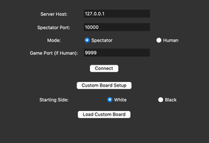
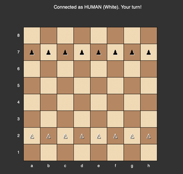
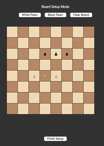
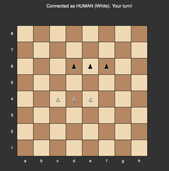

# TwoFlagsGame – README

This repository contains a pawn-only variant of chess (sometimes called "Two Flags"). It offers:

- A **server** (`server.py`) which listens for two players (human or AI) and, optionally, a spectator GUI.
- A **custom AI agent** (`agent.py`) which calculates moves with an alpha–beta search and an internal evaluation function.
- A **client** (`client.py`) for playing manually in a console.
- A **GUI** (`gui.py`) for a visual board and optional spectator functionality.
- A **random agent** (`random_agent.py`) for comparison or testing.
- A **report** (`Report.md`) discussing the approach, heuristics, and example games.

Below is a quick guide to set up the server, connect the agent, and interpret the agent's output.

---

## Table of Contents

1. [Project Overview](#project-overview)
2. [Main Files](#main-files)
3. [Running the Game](#running-the-game)
   1. [Starting the Server](#starting-the-server)
   2. [Playing from the Beginning Against the Agent](#playing-from-the-beginning-against-the-agent)
   3. [Optional GUI Usage](#optional-gui-usage)
4. [Interpreting the Agent's Output](#interpreting-the-agents-output)
5. [Frequently Asked Questions](#frequently-asked-questions)

---

## Project Overview

**"Two Flags"** is a simplified chess variant using only pawns. The code in this repository:

- Implements an **Alpha-Beta** (minimax) search with an **iterative deepening** approach and a **transposition table**.
- Evaluates positions via a configurable **weights** dictionary (material, advancement, promotion bonus, etc.).
- Can be run in various modes: a console-based client, an automated AI agent, or a GUI-based interface.

This makes it suitable for experimenting with basic search algorithms, heuristics, and game tree exploration.

---

## Main Files

- **`server.py`**  
  The main server that accepts two incoming connections (either human or AI). For each move, it forwards messages between them. It also optionally sends updates to a spectator on port `10000` - if the user wants to watch two agents playing.

- **`agent.py`**  
  The AI implementation (`AIAgent` class) using alpha–beta search.

- **`client.py`**  
  A command-line client for manual play. You type in moves like `e2e4`, and it sends them to the server. It also displays the board state (in text form).

- **`gui.py`**  
  A Tkinter-based graphical interface. You can connect as a "spectator" or "human" to see a live board or make moves by clicking on squares.

- **`random_agent.py`**  
  Demonstrates a simple "move at random from the set of legal moves" approach. Good for quick testing or debugging.

- **`Report.md`**  
  A detailed analysis of the AI's design, search heuristics, testing methodology, and example boards.

- **`main.py`**  
  A simple script that prints basic usage instructions.

---

## Running the Game

### 1. Starting the Server

1. Ensure you have Python ≥ 3.7 and have installed any libraries needed (see [requirements.txt](#requirements.txt) below).
2. Open a terminal and navigate to the `TwoFlagsGame` directory.
3. **Run
   server.exe**

   or:

   ```bash
   python server.py
   ```

   By default, it listens on `127.0.0.1:9999` for game connections. If a spectator GUI is used, it will listen on `127.0.0.1:10000` for that connection.

   The server will print messages like "Waiting for game connection 1..." or "Waiting for game connection 2..." until two clients connect.

   **Game will start after both players connect.**

   **Server will start the gui by default.**

   

### 2. Playing from the Beginning Against the Agent

1. by default, the server will start the gui. you can connect humen player via the gui. click "human" check box and then click the "connect" button in the GUI.

   

   

2. Next, connect a second player (which can be you as a human, or another instance of the agent). agent, run **Agent.exe** or

   ```bash
   python agent.py
   ```

   

3. The server will assign roles (e.g., "Role White" to the first connection, "Role Black" to the second). The game then begins.
4. Each side alternates moves; the server passes those moves through to the other side.

   

### 3.Watching Two AI Agents Face Each Other

To observe a match between two AI agents without controlling any side yourself:

1. **Start the server** as usual: Serer.exe **Or**

   ```bash
   python server.py

   ```

2. **Click on "Spectator" in the GUI** you will see the following window:

   

3. **Connect the first AI agent** using: Agent.exe **Or**
   ```bash
   python agent.py
   ```
4. **Connect the second AI agent** from another terminal: Agent.exe **Or**
   ```bash
   python agent.py
   ```

Now, you can watch the moves in real-time as each agent sends them to the server.

Once both agents are connected, the server will assign them roles (White, Black), and they will play automatically. You can sit back and watch the entire game unfold.

## Interpreting the Agent's Output

When **`agent.py`** is running, it prints logs similar to:

[Agent Black] move chosen: f7f5, depth=5, score=+750, time_spent=0.31s, time_left=29.69s

Where:

- **`[Agent Black]`**: The role the agent is playing.
- **`move chosen:`**: The best move found after its internal search.
- **`depth=5`**: The final search depth in alpha–beta.
- **`score=+750`**: Evaluation from Black's perspective (positive = advantage for Black, negative = advantage for White).
- **`time_spent=0.31s`**: The seconds spent calculating this move.
- **`time_left=29.69s`**: The agent's remaining allotted time (depending on your time control).

Sometimes you'll also see lines about "transposition table hits" or "best line found," which indicates the agent reusing or recalling previously searched states.

---

## Editing or Customizing the Board Setup

There are two main ways to customize the initial placement of pieces:

- Run the gui, and click "Setup" or "Custom Board Setup".

  

- In the setup window, click white button to place white pawns, just click on the square you want to place the pawn. same for black.

  

- After arranging everything, confirm or “Finish Setup.” The GUI will convert this board to a `Setup` string.

  

- click "Load Custom Board" button in the gui. you will get the setup string in a message box.

  

- Then connect normally with two clients.

  

  You’ll see your arrangement in the server logs, and the game starts with the custom position.

  

  

Be aware that if both sides attempt to specify different setups, the server may only accept the first one. Double-check your logs to confirm which setup was used.

---
